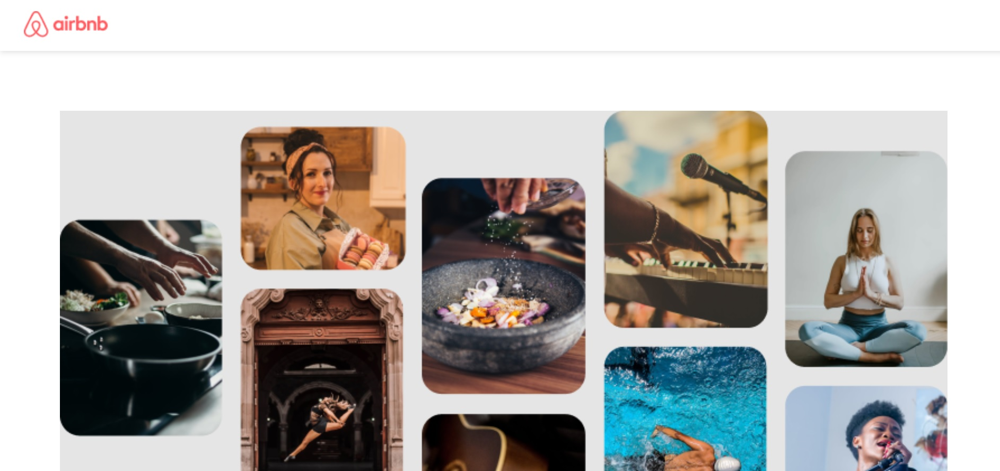
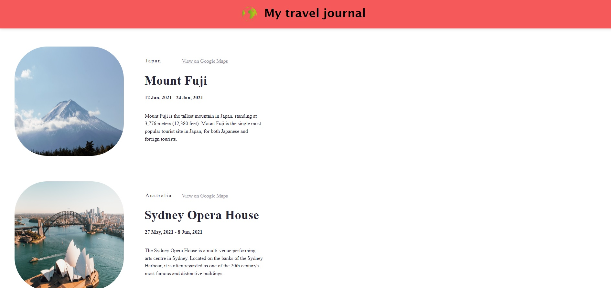
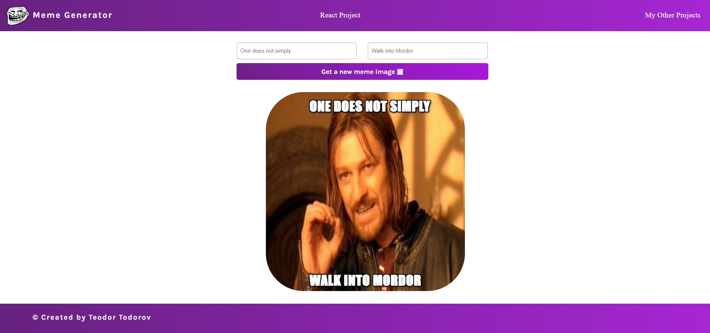
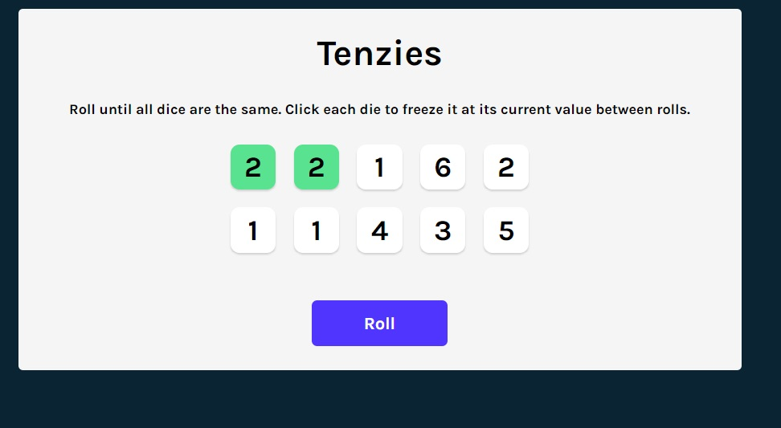

<h1 align="center">Different React Single Page Applications</h1>

**_
Some of the applications are static and it's used only basic React concepts. Other are dinamic React apps with different features.
_**

    

    <h2 align="center">Airbnb</h2>
    
    

    <h2 align="center">Travel journal</h2>
    
    

    <h2 align="center">Meme generator</h2>
    
    

    <h2 align="center">Tenzies game</h2>
    
    

    

