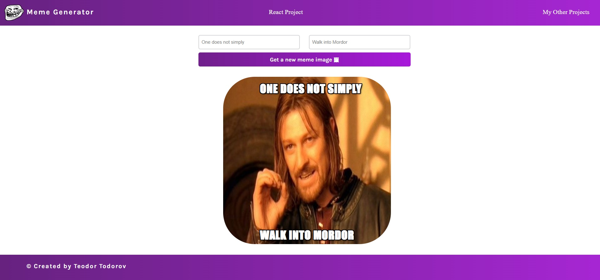
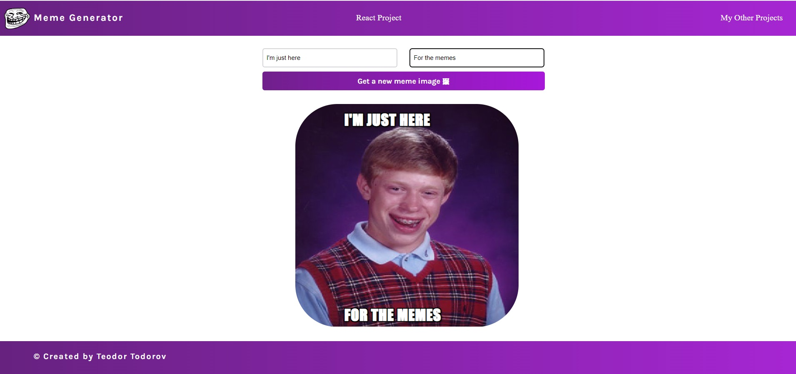

<h1 align="center"><i>Meme Generator</i></h1>

**_
React Application, which allows various memes to be generated. The pictures are fetched from REST Api 'https://api.imgflip.com/. There is an option to add selected text to the top and bottom of the photos.
_**

    

    <h2 align="center">First Meme</h2>
    
    

    <h2 align="center">Second Meme</h2>
    
    

    

<h2>Setup:</h2>
- <i><b>Download or clone the repository</b></i> 
- <i><b>To start: run npm start</b></i>

Used features of the platform:

- <i><b>Responsive Design</b></i>
- <i><b>Add different pictures</b></i>
- <i><b>Add selected text</b></i>
- <i><b>Edit text</b></i>

Used technologies:

- <i><b>JavaScript with React library</b></i>
- <i><b>HTML</b></i>
- <i><b>CSS</b></i>

