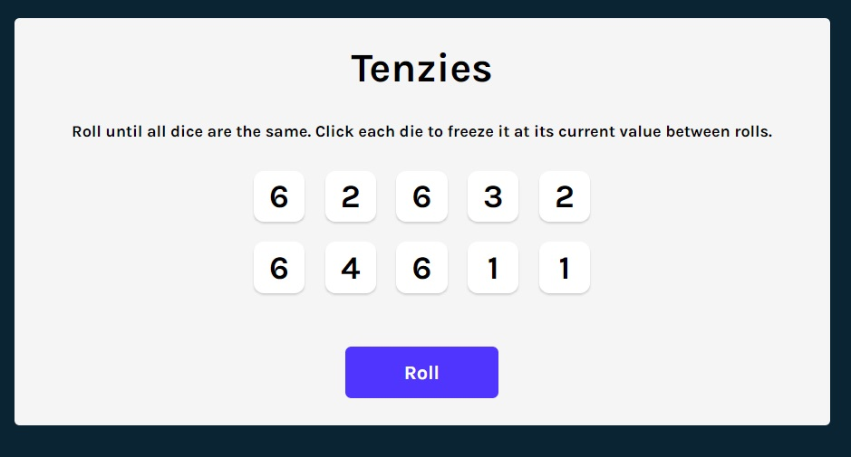
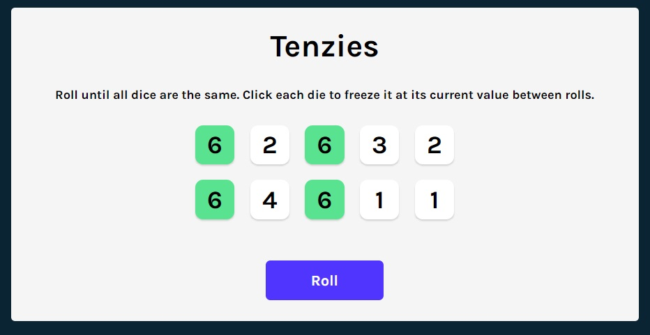
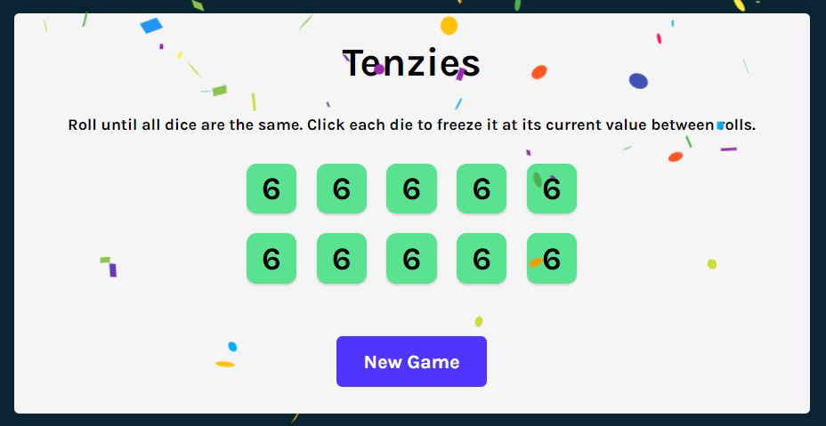

<h1 align="center"><i>Tenzies Game</i></h1>

**_
Tenzies is a game played with dice, the goal being to get the same number of dice with the minimum number of rolls..
_**

    

    <h2 align="center">Start</h2>
    
    

    <h2 align="center">Some selected dices</h2>
    
    

    <h2 align="center">Finish</h2>
    
    

<h2>Setup:</h2>
- <i><b>Download or clone the repository</b></i> 
- <i><b>To start: run npm start</b></i>

Used technologies:

- <i><b>JavaScript with React library</b></i>
- <i><b>HTML</b></i>
- <i><b>CSS</b></i>

Dependencies, (besides Create-React-App deps): 

- nanoid
- Confetti